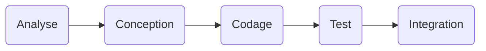
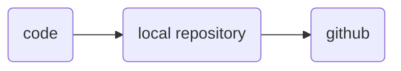

# Cycle de vie du logiciel #

## Description ##

## Implémantation ##
- codage / programmation
- test
- analyse
- conception

# Source control #
La gestion du code source.
On utilise git, mais il y a d'autres systemes (subversion, mercurial).

Le flux quand on développe.

Mais avant, il faut initier le repository :

